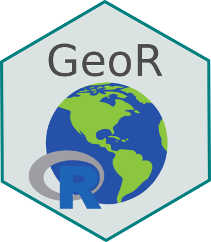

 

## What you will learn

- Get a general understanding of the practical workings of version control through git and GitHub
- Understand the main elements of the R language and the use of the RStudio IDE
- Understand how the tidyverse workflow works (import, transform, visualize, model, communicate)
- Acquire general notions of the main concepts related to geoprocessing
- Use the R language for manipulation and operations on geospatial data
- Create maps for visualization of geospatial data

## Program overview

In GeoR students will be introduced to the main theoretical and practical concepts of the R language and its use for manipulation and visualization of tabular and geospatial data. Topics such as version control, git and GitHub will be covered; functioning of the R language; data structure and manipulation in R; tidyverse overview; tabular data visualization; geospatial data structure and source; and visualization of geospatial data.

## Meet instructors

[Prof. Maurício Humberto Vancine (convidado)](https://mauriciovancine.github.io/)  
[Prof. Milton Cezar Ribeiro (responsável)](https://leec.eco.br/)

## More informations


## License

The online version of this book will always be **free** and distributed under license [CC BY-NC 4.0](https://creativecommons.org/licenses/by-nc/4.0/).

---