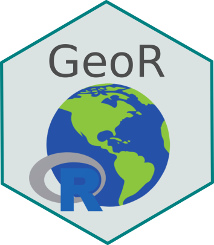

 

## O que você irá aprender

- Ter noções gerais do funcionamento prático do controle de versão através do git e GitHub
- Entender os principais elementos da linguagem R e o uso da IDE RStudio
- Compreender o funcionamento do fluxo de trabalho do tidyverse (importar, transformar, visualizar, modelar, comunicar)
- Adquirir noções gerais dos principais conceitos relacionados ao geoprocessamento
- Usar a linguagem R para manipulação e operações em dados geoespaciais
- Criar mapas para visualização de dados geoespaciais

## Visão geral do programa

Na GeoR, os alunes serão apresentados aos principais conceitos teóricos e práticos do funcionamento da linguagem R e seu uso para manipulação e visualização de dados tabulares e geoespaciais. Serão abordados temas como controle de versão, git e GitHub; funcionamento da linguagem R; estrutura e manipulação de dados no R; visão geral do tidyverse; visualização de dados tabulares; estrutura e fonte de dados geoespaciais; e visualização de dados geoespaciais.

## Conheça os instrutores

[Prof. Maurício Humberto Vancine (convidado)](https://mauriciovancine.github.io/)  
[Prof. Milton Cezar Ribeiro (responsável)](https://leec.eco.br/)

## Mais informações


## Licença

A versão online deste livro será sempre **gratuita** e distribuída sob a liceça [CC BY-NC 4.0](https://creativecommons.org/licenses/by-nc/4.0/).

---